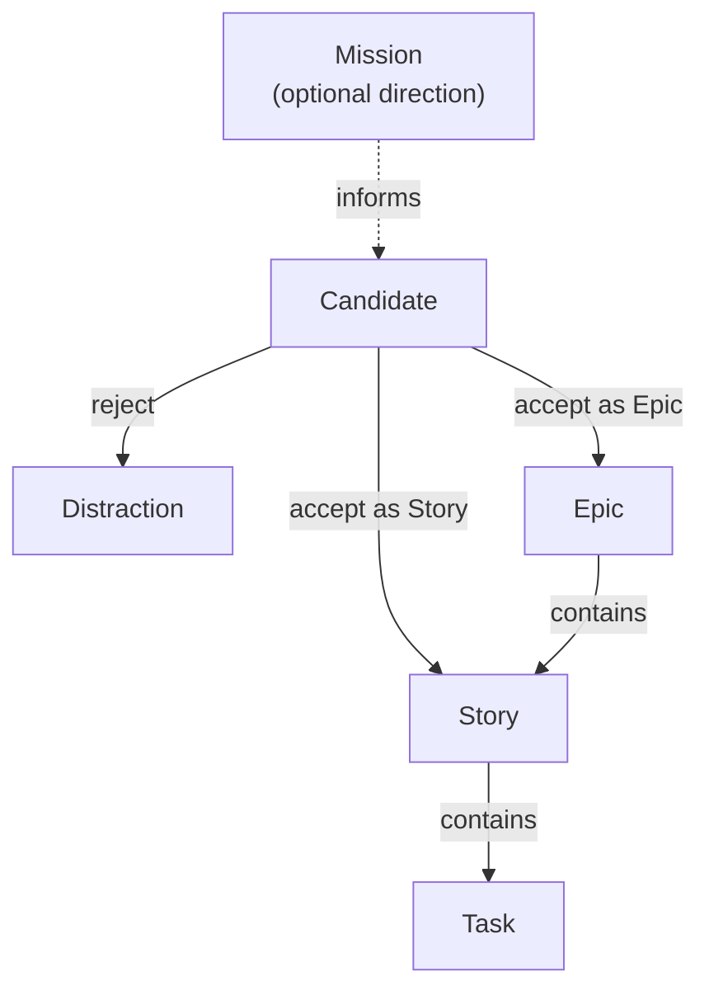
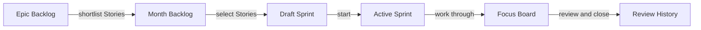

# How Focus Flow works

Focus Flow is a personal work-management system. It connects long-term
direction to observable weekly outcomes and concrete daily actions while
keeping every decision visible in your own Markdown notes.

It is deliberately small. One person chooses what matters, limits current work,
finishes or revises explicit commitments, and learns from completed Sprints.

## The model at a glance

### Work model

### Planning flow

The arrows describe decisions, not automation. Focus Flow does not decide what
matters, calculate priority, or carry unfinished work into the next Sprint for
you.

## Decide what deserves attention

### Mission

A Mission is an optional statement of direction. It can help you compare a new
idea with the kind of work and life you want to build. Focus Flow never treats
Mission alignment as a permission check: a missing Mission does not block any
workflow.

### Candidate and Entry Review

A Candidate is an idea, request, or intention that has not entered the work
system yet. Capture it without organizing it immediately, then return when you
are ready to decide.

Entry Review is optional reflection recorded in the Candidate note. Useful
questions include:

- Do I want the result, or do I only feel that I should do it?
- Whose outcome does this serve?
- Does it support my Mission or another direction I consciously chose?
- Is this mine to do, and is now the right time?
- Is the scope smaller than it first appears?

These questions support judgment; they do not produce an automatic verdict.

Accept a Candidate as an Epic when it represents a long-lived direction.
Accept it as a Story when it represents a weekly-scale result under an existing
Epic. Reject it as a Distraction when it should not enter the system. Keeping
Distractions provides evidence for analyzing recurring patterns, costs, and
persistent sources of distraction later.

## Describe work at the right level

### Epic: a continuing direction

An Epic provides strategic context over months or longer. It remains active
while you consciously intend to continue it.

Example: `Build a practical understanding of cognitive psychology`.

The Epic Backlog is one priority-ordered list. Its order expresses relative
importance, not a deadline or annual delivery promise.

### Story: an observable outcome

A Story belongs to exactly one Epic and states a result that can reasonably be
evaluated within a weekly Sprint.

Example: `Summarize five cognitive-bias ideas from a book with personal examples`.

Acceptance Criteria make the result observable. They describe what must be
true, not the sequence of actions used to get there. A Story needs at least one
criterion before Sprint selection.

### Task: a concrete action

A Task belongs to exactly one Story and should fit within a day or less.

Examples:

- read the selected chapters;
- extract five useful ideas;
- write one personal example for each idea;
- edit the final summary.

Reading a chapter is an action, so it is a Task. A usable summary is an outcome,
so it is a Story. Keeping that distinction makes Sprint review about results
rather than activity volume.

## Move decisions through planning horizons

Focus Flow uses increasingly narrow planning horizons:

1. **Epic Backlog** orders accepted, active Epics.
2. A newly accepted Story starts inside its Epic.
3. **Month Backlog** is a rolling shortlist of Stories worth considering for
   upcoming Sprints. Adding a Story to Month is an explicit decision.
4. **Draft Sprint** is a reversible selection from Month.
5. **Active Sprint** is the calendar-aligned weekly commitment. It remains
   Active until explicitly closed.
6. **Focus Board** shows the Tasks belonging to the Active Sprint's Stories.

Backlogs express relative priority. They do not assign due dates. Sprint codes
count commitments that actually started, so taking a break creates no missing
Sprint numbers.

## Keep Task state honest

The Focus Board describes what is true now:

| State | Meaning |
| --- | --- |
| **TODO** | The Task is open but not selected for a nearer horizon. |
| **Tomorrow** | You manually selected it for your next day of work. |
| **Today** | You manually selected it for your current day. |
| **In Progress** | You are actively doing it. |
| **External In Progress** | Work is proceeding outside your direct control. |
| **On Hold** | You intentionally paused it. |
| **Done** | The intended action is complete. |

Tomorrow and Today are intentions, not dates or automatic schedules. The Move
menu offers only valid next states. Optional WIP policies can leave a limit off,
ask before exceeding it, or enforce it.

## Use a deliberate weekly rhythm

### Before the Sprint

1. Review Candidates and decide what should enter the system.
2. Reorder Epics and the Month Backlog as priorities change.
3. Create a Draft Sprint and select a small set of Stories.
4. Check each Story's Acceptance Criteria and supporting Tasks.
5. Start the Sprint deliberately.

### During the Sprint

1. Choose Tasks for Tomorrow and Today.
2. Move Tasks as their real state changes.
3. Limit active work instead of filling every available column.
4. If Sprint membership changes, confirm the decision explicitly.

### At Sprint close

1. Evaluate each Story Attempt as Achieved, Not Achieved, or Closed.
2. Resolve every unfinished Task explicitly.
3. Optionally record Story Reflection, Wins, Friction, and Improvements.
4. Review the complete decision set and close the Sprint.

There is no automatic carry-over. An unfinished Story returns to an explicit
Month Backlog position before it can be selected again. An unfinished Task is
continued, moved, reclassified, or closed through a deliberate resolution.

## Learn without turning history into another backlog

History projects evidence from Closed Sprints, Story Outcomes, completed work,
and retrospective notes. It groups every 4, 12, and 48 Closed Sprints into
Month, Quarter, and Year Review Cycles. These are cadence markers, not calendar
containers or delivery plans.

Use History to notice patterns, recover useful Improvements as Candidates, and
adjust future choices. It records what happened; it does not calculate what you
should do next.

## Boundaries

Focus Flow intentionally does not provide:

- estimates, points, velocity, or time tracking;
- automatic priorities, scheduling, reminders, or recurring Tasks;
- team ownership, assignments, permissions, or collaboration workflows;
- automatic Sprint start, close, or carry-over;
- a second database that replaces your Markdown.

The system provides structure and evidence. You retain responsibility for
direction, priority, scope, and judgment.
